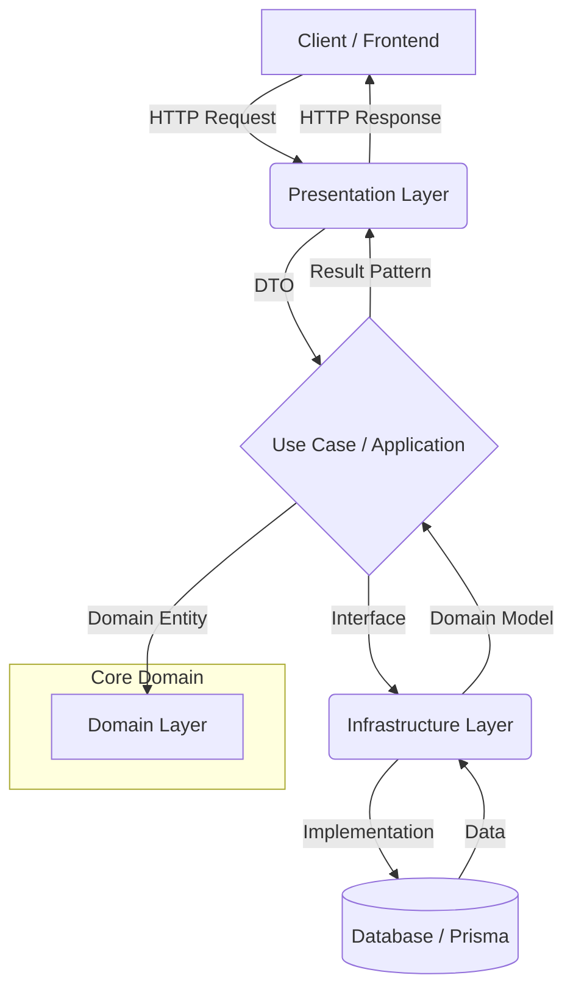

O backend do **SeboStockControl** é construído com **NestJS**, seguindo os princípios de **Clean Architecture** e **Domain-Driven Design (DDD)** para garantir o desacoplamento das regras de negócio em relação à infraestrutura.

## 📐 Fluxo de Requisição (Request Flow)

## 📂 Estrutura de Camadas (Per-Module)

Cada módulo do sistema (ex: `user`, `auth`) é subdividido nas seguintes camadas:

### 1. `domain/` (Coração do Sistema)
- **Entidades:** Classes puras que definem o estado e as regras de negócio essenciais.
- **Interfaces de Repositório:** Definição dos contratos de persistência que as camadas externas devem implementar.
- **Value Objects:** Objetos imutáveis para garantir consistência em dados específicos.
- **⚠️ Regra de Ouro:** Esta camada não deve depender de **nada** externo (Prisma, NestJS, etc).

### 2. `application/` (Orquestração)
- **Use Cases:** Classes que executam fluxos específicos da aplicação. Coordenam as entidades e os repositórios.
- **CQRS:** Divisão entre comandos (Escrita) e consultas (Leitura) quando necessário.
- **DTOs Internos:** Saída de dados formatada para as camadas externas.

### 3. `infrastructure/` (Detalhes Técnicos)
- **Repositórios (Prisma):** Implementação concreta do acesso a dados.
- **Adapters de API:** Integração com serviços de terceiros (E-mail, SMS, Cloud Storage).
- **Mappers:** Converte objetos do banco de dados (Prisma Models) para Entidades de Domínio e vice-versa.

### 4. `presentation/` (Interface Exterior)
- **Controllers:** Exposição de endpoints REST ou GraphQL.
- **DTOs de Entrada (Validation):** Uso de `class-validator` ou `Zod` para blindar a entrada de dados.
- **Pipes e Interceptors:** Tratamento transversal de dados e erros.

## 🧩 Padrões de Design Utilizados

- **Result Pattern:** Todas as operações retornam um objeto `Result<T, E>`, evitando o uso de `exceptions` para controle de fluxo.
- **Dependency Injection:** Todas as dependências são injetadas no construtor para facilitar testes unitários automatizados.
- **Repository Pattern:** Desacoplamento total do banco de dados (Prisma) em relação à lógica de negócio.

## 🧪 Testes
- **Unitários:** Focam nas entidades e Use Cases (`.spec.ts`).
- **Integração (E2E):** Focam nos fluxos completos via API (`.e2e-spec.ts`).

---
*Para dúvidas sobre implementação, consulte `CONTRIBUTING.md`.*
